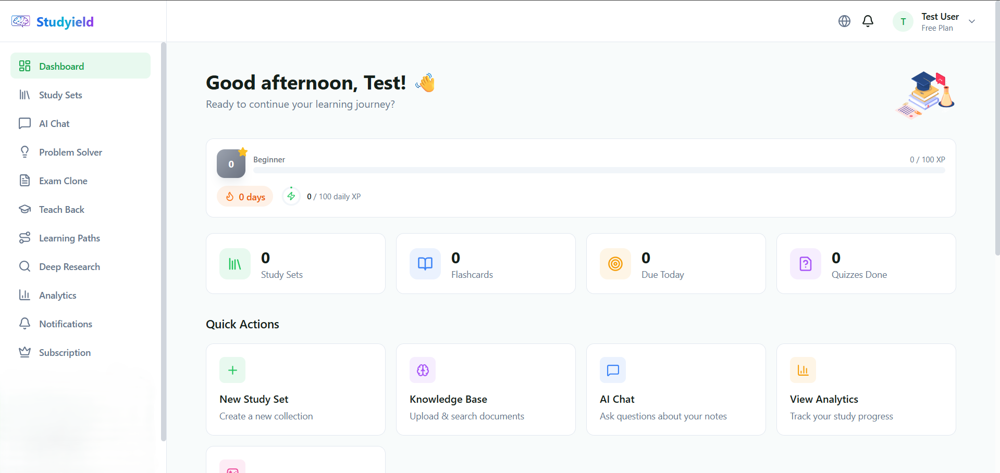

<p align="center">
  <a href="https://studyield.com">
    
  </a>
</p>

<p align="center">
  <a href="https://github.com/studyield/studyield/blob/main/LICENSE"></a>
  <a href="https://github.com/studyield/studyield/stargazers"></a>
  <a href="https://github.com/studyield/studyield/issues"></a>
  <a href="https://github.com/studyield/studyield/pulls"></a>
</p>

<p align="center">
  <a href="https://docs.studyield.com">ডকুমেন্টেশন</a> |
  <a href="#দ্রুত-শুরু">দ্রুত শুরু</a> |
  <a href="https://github.com/studyield/studyield/discussions">আলোচনা</a> |
  <a href="CONTRIBUTING.md">অবদান</a>
</p>

<p align="center">
  <a href="./README.md">English</a> |
  <a href="./README_JA.md">日本語</a> |
  <a href="./README_ZH.md">中文</a> |
  <a href="./README_KO.md">한국어</a> |
  <a href="./README_ES.md">Español</a> |
  <a href="./README_FR.md">Français</a> |
  <a href="./README_DE.md">Deutsch</a> |
  <a href="./README_PT-BR.md">Português</a> |
  <a href="./README_AR.md">العربية</a> |
  বাংলা |
  <a href="./README_HI.md">हिन्दी</a> |
  <a href="./README_RU.md">Русский</a>
</p>

---

## Studyield কী?

Studyield হল একটি **ওপেন-সোর্স AI-চালিত শেখার প্ল্যাটফর্ম** যা ব্যক্তিগত কন্টেন্ট, বুদ্ধিমান টিউটরিং এবং অভিযোজিত মূল্যায়নের মাধ্যমে শিক্ষার্থীদের আরও কার্যকরভাবে পড়াশোনা করতে সাহায্য করে। শিক্ষার্থী, শিক্ষক এবং জীবনব্যাপী শিক্ষার্থীদের জন্য তৈরি, Studyield অত্যাধুনিক AI প্রযুক্তির সাথে প্রমাণিত শিক্ষা বিজ্ঞানকে একত্রিত করে।

ঐতিহ্যবাহী শেখার প্ল্যাটফর্মগুলির বিপরীতে যেগুলি শুধুমাত্র কন্টেন্ট সরবরাহের উপর ফোকাস করে বা AI টিউটরিং টুলগুলির যা ব্যাপক অধ্যয়ন বৈশিষ্ট্যের অভাব রয়েছে, Studyield আপনাকে 6টি শক্তিশালী AI বৈশিষ্ট্য, একটি সম্পূর্ণ অধ্যয়ন টুলকিট এবং মাল্টি-প্ল্যাটফর্ম অ্যাক্সেস সহ একটি সম্পূর্ণ শেখার ইকোসিস্টেম দেয়।

<p align="center">
  
  <br>
  <em>Studyield এর AI-চালিত শেখার ড্যাশবোর্ড</em>
</p>

### এটি কীভাবে কাজ করে

1. **আপনার উপকরণ আপলোড করুন** -- আপনার জ্ঞান বেসে অধ্যয়ন উপকরণ (PDF, ডকুমেন্ট, পূর্ববর্তী পরীক্ষা) যোগ করুন
2. **AI বিশ্লেষণ ও সংগঠিত করে** -- আমাদের AI মূল ধারণাগুলি বের করে, জ্ঞান গ্রাফ তৈরি করে এবং অনুসন্ধানযোগ্য এম্বেডিং তৈরি করে
3. **অনুশীলন ও শিখুন** -- অনুশীলন পরীক্ষা তৈরি করুন, মাল্টি-এজেন্ট AI দিয়ে সমস্যা সমাধান করুন, ফ্ল্যাশকার্ড দিয়ে নিজেকে পরীক্ষা করুন
4. **প্রতিক্রিয়া পান** -- আপনার বোঝাপড়া পরীক্ষা করতে এবং জ্ঞান ফাঁক চিহ্নিত করতে টিচ-ব্যাক মূল্যায়ন ব্যবহার করুন
5. **অগ্রগতি ট্র্যাক করুন** -- বিশ্লেষণের সাহায্যে আপনার শেখার গতি, দক্ষতার স্তর এবং অধ্যয়ন প্যাটার্ন মনিটর করুন

### মূল ক্ষমতা

- **🎯 পরীক্ষার ক্লোন** -- পূর্ববর্তী পরীক্ষা আপলোড করুন এবং একই স্টাইল, অসুবিধা এবং ফর্ম্যাটে নতুন অনুশীলন প্রশ্ন তৈরি করুন
- **🤖 মাল্টি-এজেন্ট সমস্যা সমাধানকারী** -- বিশ্লেষণ, সমাধান এবং যাচাইকরণ এজেন্ট একসাথে কাজ করে রিয়েল-টাইম স্ট্রিমিং সহ জটিল সমস্যা সমাধান করতে
- **🕸️ জ্ঞান গ্রাফ** -- অধ্যয়ন উপকরণ থেকে স্বয়ংক্রিয়ভাবে সত্তা এবং সম্পর্ক বের করে ইন্টারঅ্যাক্টিভ ভিজুয়ালাইজেশনে
- **🎙️ টিচ-ব্যাক মূল্যায়ন** -- শিক্ষার্থীরা ধারণা ব্যাখ্যা করে (টেক্সট/ভয়েস), AI ফাইনম্যান কৌশল ব্যবহার করে বোঝাপড়া মূল্যায়ন করে
- **🔬 ডিপ রিসার্চ মোড** -- আপলোড করা উপকরণ থেকে RAG + ওয়েব সার্চ, উদ্ধৃতি সহ কাঠামোগত রিপোর্ট তৈরি করে
- **💻 কোড স্যান্ডবক্স** -- NumPy, Pandas এবং বৈজ্ঞানিক লাইব্রেরি সমর্থন সহ নিরাপদ Python সম্পাদন
- **📚 জ্ঞান বেস** -- সিমান্টিক সার্চ এবং RAG এর জন্য ডকুমেন্ট (PDF, DOCX) আপলোড করুন
- **🃏 SRS সহ ফ্ল্যাশকার্ড** -- সর্বোত্তম মুখস্থকরণের জন্য স্পেসড রিপিটিশন সিস্টেম
- **📝 AI-জেনারেটেড কুইজ** -- অধ্যয়ন উপকরণ থেকে স্বয়ংক্রিয় কুইজ তৈরি
- **💬 RAG চ্যাট** -- আপনার ডকুমেন্ট থেকে উদ্ধৃতি সহ কথোপকথন AI
- **🗺️ শেখার পথ** -- AI-জেনারেটেড সর্বোত্তম অধ্যয়ন রুট
- **📊 অগ্রগতি বিশ্লেষণ** -- অধ্যয়ন সময়, দক্ষতার স্তর এবং শেখার গতি ট্র্যাক করুন
- **🌍 12টি ভাষা** -- সম্পূর্ণ i18n সমর্থন (EN, JA, ZH, KO, ES, FR, DE, PT, AR, BN, HI, RU)
- **📱 ওয়েব + মোবাইল** -- React ফ্রন্টএন্ড এবং Flutter মোবাইল অ্যাপ

## আমরা কোন সমস্যা সমাধান করি

### আধুনিক শেখার দ্বিধা

আজকের শিক্ষার্থীরা তথ্যে ডুবে যাচ্ছে কিন্তু কার্যকর শেখার সরঞ্জামের জন্য অনাহারে রয়েছে। ঐতিহ্যবাহী অধ্যয়ন পদ্ধতিগুলি সময়সাপেক্ষ এবং অদক্ষ, যখন বিদ্যমান AI টিউটরিং সমাধানগুলি হয় খুব ব্যয়বহুল, খুব সীমিত, অথবা মালিকানাধীন প্ল্যাটফর্মে ডেটা আপলোড করা প্রয়োজন।

**আমরা যে সাধারণ সমস্যাগুলি সমাধান করি:**

- ❌ **জেনেরিক অনুশীলন উপকরণ** -- প্রি-মেড প্রশ্ন ব্যাঙ্ক আপনার প্রকৃত পরীক্ষার স্টাইল বা অসুবিধার সাথে মেলে না
- ❌ **বিচ্ছিন্ন শেখার সরঞ্জাম** -- ফ্ল্যাশকার্ড, কুইজ এবং নোট একাধিক অ্যাপ জুড়ে ছড়িয়ে ছিটিয়ে
- ❌ **গভীর বোঝাপড়ার যাচাইকরণ নেই** -- আপনি সত্যিই বুঝেছেন নাকি শুধু মুখস্থ করেছেন তা বলতে পারে না
- ❌ **ম্যানুয়াল জ্ঞান সংগঠন** -- নোট সংগঠিত করতে এবং ধারণাগুলি সংযুক্ত করতে ঘন্টা নষ্ট
- ❌ **সীমিত AI টিউটরিং** -- বেশিরভাগ AI টিউটর সমস্যা সমাধানের পদক্ষেপ বা যাচাইকরণ না দেখিয়ে উত্তর দেয়
- ❌ **গোপনীয়তার উদ্বেগ** -- ক্লোজড-সোর্স প্ল্যাটফর্মে অধ্যয়ন উপকরণ আপলোড করা
- ❌ **উচ্চ খরচ** -- প্রিমিয়াম AI শেখার সরঞ্জামগুলি প্রতি শিক্ষার্থী প্রতি মাসে $20-50 খরচ হয়

### Studyield-এর সমাধান

✅ **পরীক্ষা-স্টাইল অনুশীলন** -- নিখুঁতভাবে মেলানো অনুশীলন প্রশ্ন তৈরি করতে আপনার প্রকৃত পরীক্ষা ক্লোন করুন

✅ **অল-ইন-ওয়ান প্ল্যাটফর্ম** -- জ্ঞান বেস, ফ্ল্যাশকার্ড, কুইজ, চ্যাট, গবেষণা এবং বিশ্লেষণ এক জায়গায়

✅ **গভীর বোঝাপড়া** -- টিচ-ব্যাক মূল্যায়ন এবং মাল্টি-এজেন্ট সমস্যা সমাধান প্রকৃত বোঝাপড়া নিশ্চিত করে

✅ **স্বয়ংক্রিয় জ্ঞান গ্রাফ** -- AI স্বয়ংক্রিয়ভাবে আপনার উপকরণ থেকে ধারণা বের করে এবং সংযুক্ত করে

✅ **উন্নত AI বৈশিষ্ট্য** -- মাল্টি-এজেন্ট সমাধান, গভীর গবেষণা, কোড এক্সিকিউশন এবং রিয়েল-টাইম স্ট্রিমিং

✅ **সেলফ-হোস্টেড এবং ওপেন সোর্স** -- আপনার নিজস্ব অবকাঠামোতে চালান, আপনার ডেটার উপর সম্পূর্ণ নিয়ন্ত্রণ

✅ **শুরু করতে বিনামূল্যে** -- Docker স্থাপনা সহ ওপেন সোর্স, ন্যায্য মূল্যের সাথে ঐচ্ছিক হোস্টেড সংস্করণ

## কেন Studyield? (তুলনা)

| বৈশিষ্ট্য | Studyield | Quizlet | Anki | ChatGPT | Khan Academy |
|---------|-----------|---------|------|---------|--------------|
| **পরীক্ষার ক্লোন** | ✅ AI-জেনারেটেড | ❌ | ❌ | ❌ | ❌ |
| **মাল্টি-এজেন্ট সমস্যা সমাধানকারী** | ✅ 3 এজেন্ট + স্ট্রিমিং | ❌ | ❌ | ✅ একক এজেন্ট | ❌ |
| **জ্ঞান গ্রাফ** | ✅ স্বয়ংক্রিয়-জেনারেটেড | ❌ | ❌ | ❌ | ❌ |
| **টিচ-ব্যাক মূল্যায়ন** | ✅ টেক্সট + ভয়েস | ❌ | ❌ | ⚠️ ম্যানুয়াল | ❌ |
| **ডিপ রিসার্চ মোড** | ✅ RAG + ওয়েব | ❌ | ❌ | ✅ | ❌ |
| **কোড স্যান্ডবক্স** | ✅ নিরাপদ এক্সিকিউশন | ❌ | ❌ | ✅ | ✅ |
| **ফ্ল্যাশকার্ড (SRS)** | ✅ | ✅ | ✅ | ❌ | ❌ |
| **RAG চ্যাট** | ✅ উদ্ধৃতি সহ | ❌ | ❌ | ✅ ডক্স ছাড়া | N/A |
| **শেখার পথ** | ✅ AI-জেনারেটেড | ❌ | ❌ | ❌ | ✅ প্রি-বিল্ট |
| **অগ্রগতি বিশ্লেষণ** | ✅ | ✅ | ⚠️ বেসিক | ❌ | ✅ |
| **সেলফ-হোস্টেড** | ✅ | ❌ | ✅ | ❌ | ❌ |
| **ওপেন সোর্স** | ✅ Apache 2.0 | ❌ | ✅ AGPL | ❌ | ❌ |
| **মাল্টি-প্ল্যাটফর্ম** | ✅ ওয়েব + মোবাইল | ✅ | ✅ | ✅ | ✅ |
| **শেখার বক্ররেখা** | 🟢 নিম্ন | 🟢 নিম্ন | 🟡 মাঝারি | 🟢 নিম্ন | 🟢 নিম্ন |

## 📊 প্রকল্পের কার্যকলাপ এবং পরিসংখ্যান

Studyield একটি **সক্রিয়ভাবে রক্ষণাবেক্ষণ করা** প্রকল্প যার একটি ক্রমবর্ধমান সম্প্রদায় রয়েছে।

## দ্রুত শুরু

### Docker (প্রস্তাবিত)

প্রকল্পের রুট থেকে এই কমান্ডগুলি চালান:

```bash
git clone https://github.com/studyield/studyield.git
cd studyield
cp backend/.env.example backend/.env
# আপনার ডাটাবেস শংসাপত্র এবং OpenRouter API কী দিয়ে backend/.env সম্পাদনা করুন
docker compose --env-file .env.docker up -d
```

এটাই! `http://localhost:5189`-এ অ্যাপ এবং `http://localhost:3010`-এ API অ্যাক্সেস করুন।

### ম্যানুয়াল সেটআপ

**পূর্বশর্ত:** Node.js 20+, PostgreSQL 15+, Redis 7+

```bash
# ক্লোন করুন
git clone https://github.com/studyield/studyield.git
cd studyield

# ব্যাকএন্ড
cd backend
cp .env.example .env
npm install
npm run migrate
npm run start:dev

# ফ্রন্টএন্ড (নতুন টার্মিনালে)
cd frontend
cp .env.example .env
npm install
npm run dev
```

অ্যাপ অ্যাক্সেস করতে `http://localhost:5189` দেখুন।

## আর্কিটেকচার

```
┌─────────────────────────────────────────────────────────────────┐
│                         Studyield Platform                       │
├─────────────────────────────────────────────────────────────────┤
│                                                                   │
│  ┌──────────────┐     ┌──────────────┐     ┌──────────────┐    │
│  │   React Web  │     │   Flutter    │     │  REST + WS   │    │
│  │  (Frontend)  │────▶│    Mobile    │────▶│     API      │    │
│  └──────────────┘     └──────────────┘     └──────┬───────┘    │
│                                                     │            │
│  ┌──────────────────────────────────────────────────┼──────────┐│
│  │              NestJS Backend (27 Modules)         │          ││
│  ├──────────────────────────────────────────────────┼──────────┤│
│  │  Auth │ AI │ Exam Clone │ Problem Solver │ Chat │          ││
│  │  Teach-Back │ Research │ Knowledge Graph │ Quiz │          ││
│  │  Flashcards │ Learning Paths │ Analytics │ ...  │          ││
│  └──────────────────────────────────────────────────┼──────────┘│
└─────────────────────────────────────────────────────────────────┘
```

## টেক স্ট্যাক

| স্তর | প্রযুক্তি |
|-------|------------|
| **ব্যাকএন্ড** | NestJS 10, TypeScript, PostgreSQL (raw SQL), Redis, Qdrant, ClickHouse, BullMQ, Socket.io |
| **ফ্রন্টএন্ড** | React 19, Vite, TypeScript, Tailwind CSS, Radix UI (shadcn), Zustand, React Query, i18next |
| **মোবাইল** | Flutter 3.10+, Provider + BLoC, Dio, Go Router, Firebase, Easy Localization |
| **AI** | OpenRouter (Claude, GPT, ইত্যাদি), OpenAI Embeddings, LangChain |

## i18n

Studyield i18next (ফ্রন্টএন্ড) এবং Easy Localization (মোবাইল) এর মাধ্যমে 12টি ভাষা সমর্থন করে:

- English, 日本語, 中文, 한국어, Español, Français, Deutsch, Português, العربية, বাংলা, हिन्दी, Русский

## 🚀 কেন Studyield-এ অবদান রাখবেন?

Studyield শুধুমাত্র আরেকটি ওপেন-সোর্স প্রকল্প নয় -- এটি AI-চালিত শিক্ষার ভবিষ্যৎ তৈরি করার এবং বিশ্বব্যাপী লক্ষ লক্ষ শিক্ষার্থীদের জন্য মানসম্পন্ন শিক্ষা অ্যাক্সেসযোগ্য করার একটি সুযোগ।

## 🗺️ প্রকল্প রোডম্যাপ

কী সম্পন্ন হয়েছে, কী চলছে এবং আমরা পরবর্তীতে কী পরিকল্পনা করছি সে সম্পর্কে বিস্তারিত তথ্যের জন্য, আমাদের **[ভবিষ্যত লক্ষ্য এবং ডেভেলপার ব্রিফিং](FUTURE_GOAL.md)** দেখুন।

## 🎯 দ্রুত অবদান গাইড

**5 মিনিটের কম সময়ে** অবদান শুরু করুন:

### ধাপ 1: আপনার পরিবেশ সেটআপ করুন

```bash
# GitHub-এ রিপোজিটরি ফর্ক করুন, তারপর আপনার ফর্ক ক্লোন করুন
git clone https://github.com/YOUR_USERNAME/studyield.git
cd studyield

# Docker দিয়ে শুরু করুন (সহজতম উপায়)
cp backend/.env.example backend/.env
docker compose --env-file .env.docker up -d

# অ্যাপ অ্যাক্সেস করুন
# ফ্রন্টএন্ড: http://localhost:5189
# ব্যাকএন্ড API: http://localhost:3010
```

### ধাপ 2: কাজ করার জন্য কিছু খুঁজুন

আপনার অভিজ্ঞতার স্তরের উপর ভিত্তি করে বেছে নিন:

**🟢 নতুনদের জন্য বন্ধুত্বপূর্ণ**
- 📝 [টাইপো ঠিক করুন বা ডকুমেন্টেশন উন্নত করুন](https://github.com/studyield/studyield/issues?q=is%3Aissue+is%3Aopen+label%3Adocumentation)
- 🌍 [অনুবাদ যোগ করুন](https://github.com/studyield/studyield/issues?q=is%3Aissue+is%3Aopen+label%3Ai18n) -- আমরা 12টি ভাষা সমর্থন করি
- 🐛 [সহজ বাগ ঠিক করুন](https://github.com/studyield/studyield/issues?q=is%3Aissue+is%3Aopen+label%3A%22good+first+issue%22)

**🟡 মধ্যবর্তী**
- 🔌 নতুন AI এজেন্ট টুল বা ক্ষমতা যোগ করুন
- 📊 বিশ্লেষণ ড্যাশবোর্ড এবং ভিজুয়ালাইজেশন উন্নত করুন
- 🧪 [টেস্ট লিখুন](https://github.com/studyield/studyield/issues?q=is%3Aissue+is%3Aopen+label%3Atesting)

**🔴 উন্নত**
- 🤖 নতুন AI বৈশিষ্ট্য তৈরি করুন
- ⚙️ [কোর ইঞ্জিন উন্নতি](https://github.com/studyield/studyield/issues?q=is%3Aissue+is%3Aopen+label%3Acore)
- 🔐 [নিরাপত্তা বৈশিষ্ট্য](https://github.com/studyield/studyield/issues?q=is%3Aissue+is%3Aopen+label%3Asecurity)

## অবদান

আমরা অবদানকে স্বাগত জানাই! শুরু করতে আমাদের [অবদান গাইড](CONTRIBUTING.md) দেখুন।

## অবদানকারী

Studyield-এ অবদান রেখেছেন এমন সকল আশ্চর্যজনক মানুষদের ধন্যবাদ! 🎉

<a href="https://github.com/studyield/studyield/graphs/contributors">
  
</a>

## 💬 আমাদের সম্প্রদায়ে যোগ দিন

ডেভেলপারদের সাথে সংযুক্ত হন, সাহায্য পান এবং Studyield-এর সর্বশেষ উন্নয়ন সম্পর্কে আপডেট থাকুন!

<p align="center">
  <a href="https://github.com/studyield/studyield/discussions">
    
  </a>
  <a href="https://discord.gg/9JEk6WSM">
    
  </a>
  <a href="https://twitter.com/studyield">
    
  </a>
</p>

## নিরাপত্তা

দয়া করে দায়িত্বশীলভাবে নিরাপত্তা দুর্বলতাগুলি রিপোর্ট করুন। আমাদের প্রকাশ নীতির জন্য [SECURITY.md](SECURITY.md) দেখুন।

## লাইসেন্স

এই প্রকল্পটি [Apache License 2.0](LICENSE) এর অধীনে লাইসেন্সপ্রাপ্ত।

Copyright 2025 Studyield Contributors.

## স্বীকৃতি

NestJS, React, Flutter, PostgreSQL, Redis, Qdrant, ClickHouse, OpenRouter এবং অন্যান্য অনেক আশ্চর্যজনক ওপেন-সোর্স প্রযুক্তি দিয়ে তৈরি।

---

<p align="center">
  <a href="https://studyield.com">ওয়েবসাইট</a> |
  <a href="https://docs.studyield.com">ডকুমেন্টেশন</a> |
  <a href="https://github.com/studyield/studyield/discussions">আলোচনা</a> |
  <a href="https://twitter.com/studyield">Twitter</a>
</p>

---

<p align="center">
  <strong><a href="https://github.com/studyield">Studyield</a> সম্প্রদায় দ্বারা ❤️ দিয়ে নির্মিত</strong>
</p>

<p align="center">
  আপনি যদি এই প্রকল্পটি দরকারী মনে করেন, দয়া করে এটিকে একটি তারকা দিতে বিবেচনা করুন! ⭐
  <br><br>
  <a href="https://github.com/studyield/studyield/stargazers">
    
  </a>
</p>
